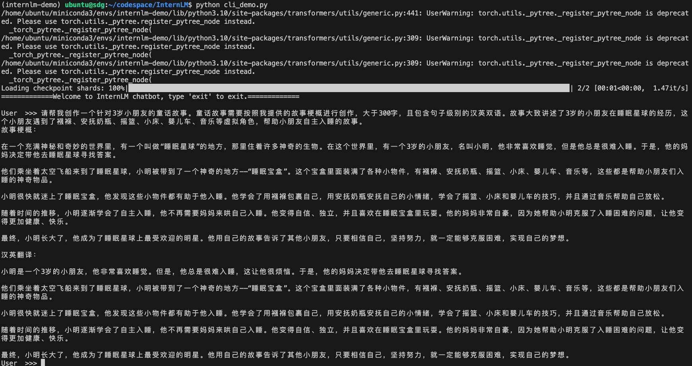
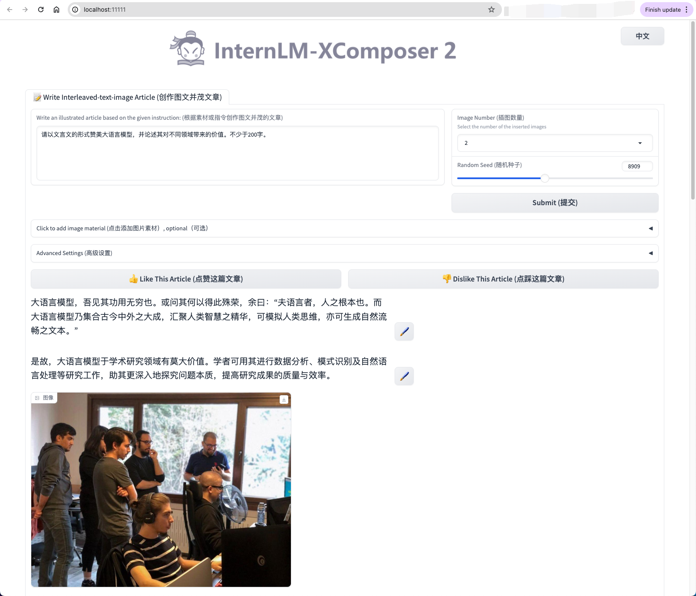
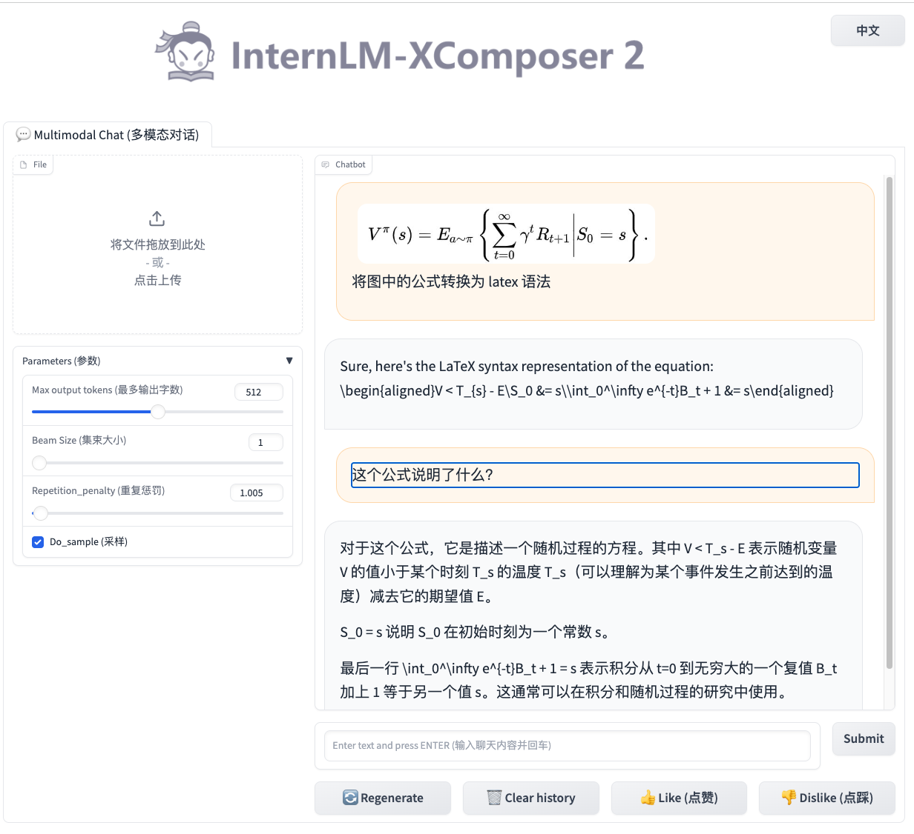
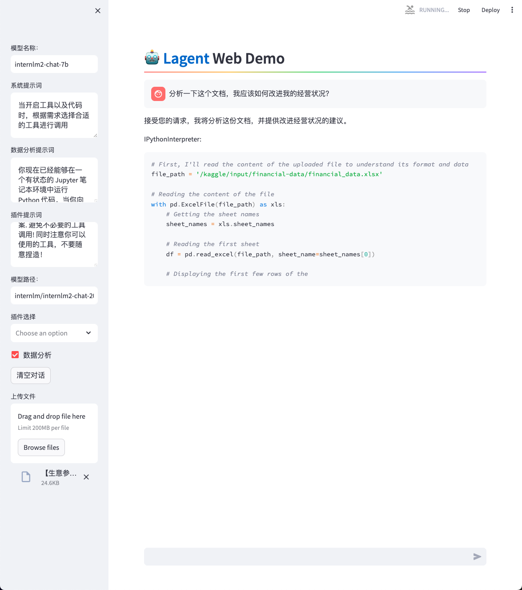

#### 使用 `InternLM2-Chat-1.8B` 模型生成 300 字的小故事（需截图）

#### 使用 `huggingface_hub` python 包，下载 `InternLM2-Chat-7B` 的 `config.json`

####  `浦语·灵笔2` 的 `图文创作` 部署

####  `浦语·灵笔2` 的 `视觉问答` 部署

#### `Lagent` 工具调用 `数据分析` Demo 部署

