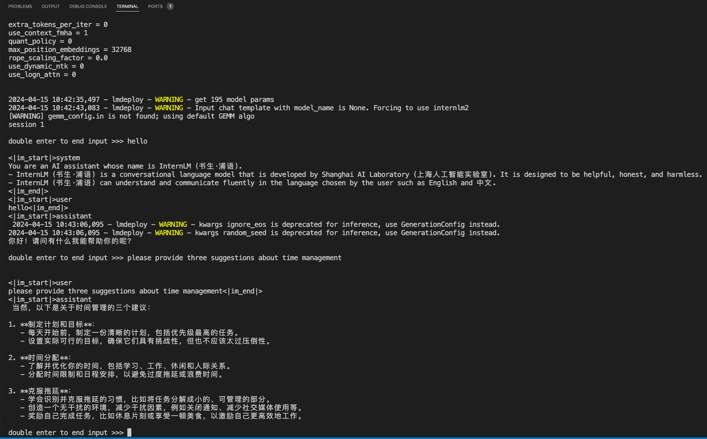
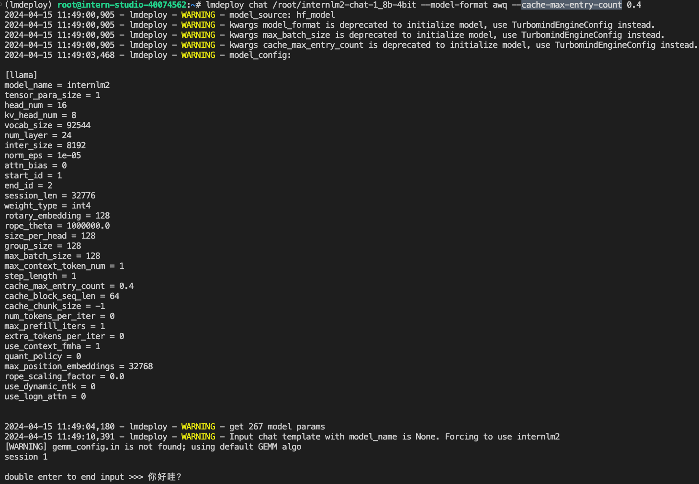
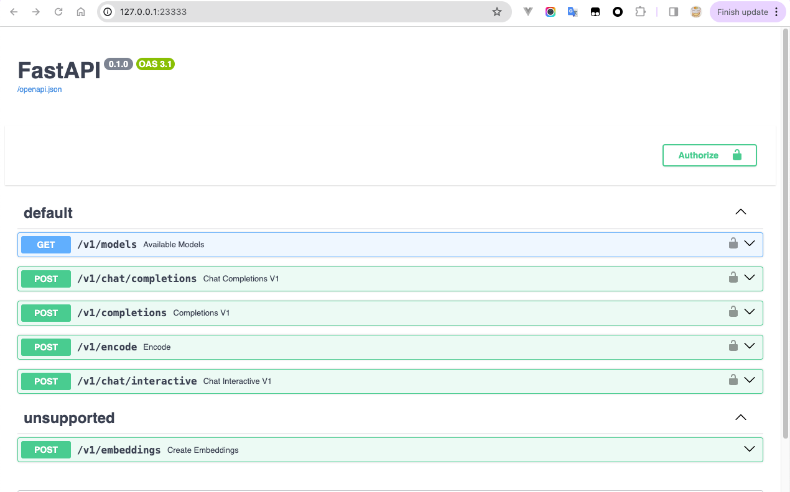
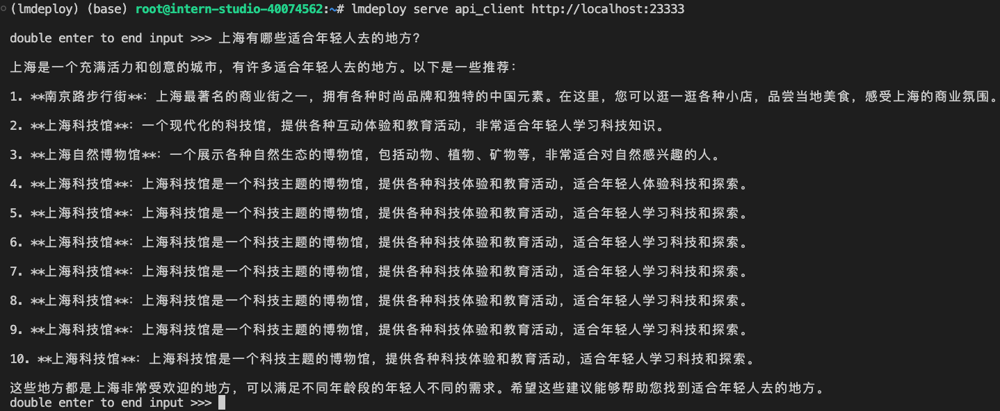
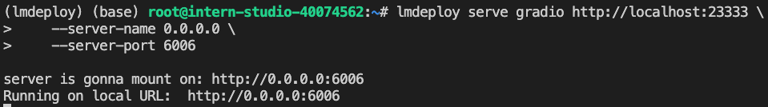
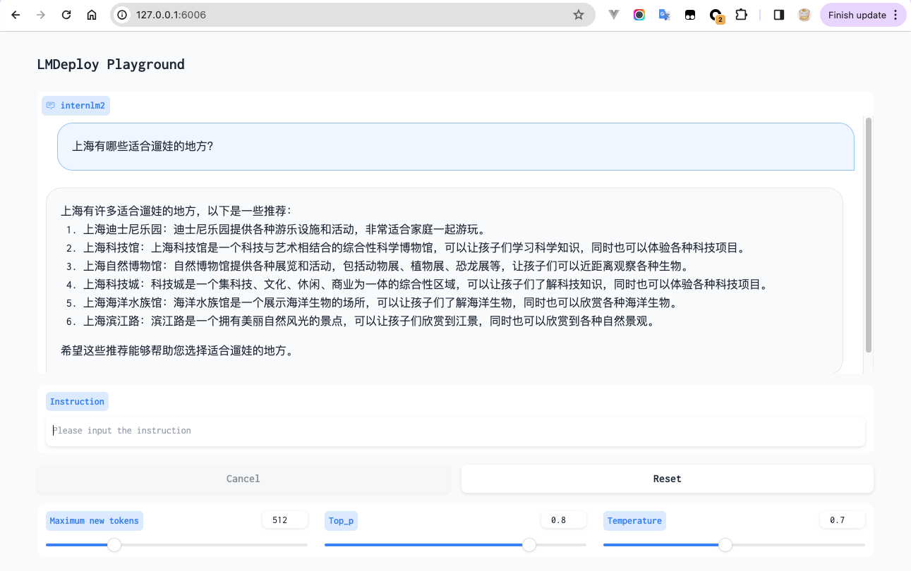
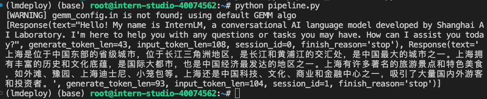
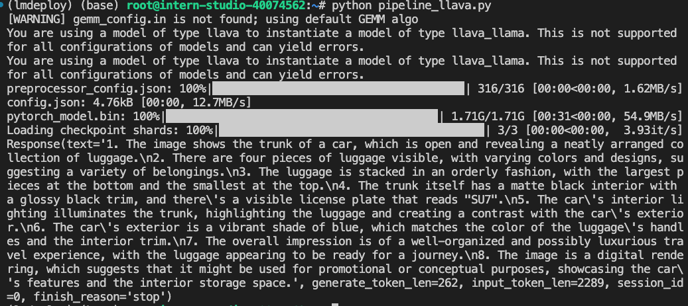
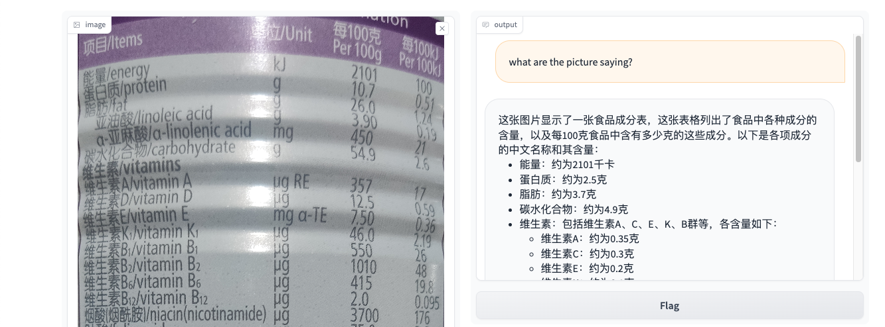

## 1. 以命令行方式与 InternLM2-Chat-1.8B 模型对话



**对比 KV Cache 占用的显存比**

| 配置项   | cache-max-entry-count=0.8 | cache-max-entry-count=0.4 | cache-max-entry-count=0.01 |
| -------- | ------------------------- | ------------------------- | -------------------------- |
| 显存占用 | 20936 MiB                 | 12784 MiB                 | 4712 MiB                   |

配置如下：

| 配置项                  | 值        |
| ----------------------- | --------- |
| model_name              | internlm2 |
| tensor_para_size        | 1         |
| head_num                | 16        |
| kv_head_num             | 8         |
| vocab_size              | 92544     |
| num_layer               | 24        |
| inter_size              | 8192      |
| norm_eps                | 1e-05     |
| attn_bias               | 0         |
| start_id                | 1         |
| end_id                  | 2         |
| session_len             | 32776     |
| weight_type             | bf16      |
| rotary_embedding        | 128       |
| rope_theta              | 1000000.0 |
| size_per_head           | 128       |
| group_size              | 0         |
| max_batch_size          | 128       |
| max_context_token_num   | 1         |
| step_length             | 1         |
| cache_max_entry_count   | 0.8       |
| cache_block_seq_len     | 64        |
| cache_chunk_size        | -1        |
| num_tokens_per_iter     | 0         |
| max_prefill_iters       | 1         |
| extra_tokens_per_iter   | 0         |
| use_context_fmha        | 1         |
| quant_policy            | 0         |
| max_position_embeddings | 32768     |
| rope_scaling_factor     | 0.0       |
| use_dynamic_ntk         | 0         |
| use_logn_attn           | 0         |

## 2. 设置 KV Cache 最大占用比例为 0.4，开启 W4A16 量化，以命令行方式与模型对话。

W4A16 量化前：共有 3.6G，其中模型文件 1.9 + 1.7 = 3.6G

W4A16 量化后：1.5G

这里实验的是 InternLM2-1.8B，其配置如下：

* 词典大小：92544
* 最大序列长度：32768
* 模型宽度：2048
* 前馈MLP：8192
* 层数：24

这里不考虑模型结构，仅考虑参数：

1. 词嵌入：92544 * 2048 = 189530112
2. 位置嵌入：暂时忽略
3. 多头注意力QKV：4 * 24 * 2048 ^ 2 = 402653184
4. FFN：24 * 2 * 2048 * 8192 = 805306368
5. 归一化层：24 * 2 * 2048 = 98304
6. 偏置项：暂时忽略、

总参数量：1,397,587,968

总字节数：2.6G

量化后计算公式为：189530112 * 2 + 402653184 / 2 + 805306368 / 2 + 98304 * 2 = 983,236,608 = 0.9G

减少的存储空间为：2.6G - 0.9G = 1.7G

实际减少的存储空间为：3.6G - 1.5G = 1.6G

计算后发现大体相当，这可能是由于如下原因造成：

1. **非权重部分的存储需求**：模型文件中除了权重之外，还可能包含结构信息、偏置项（通常仍以较高精度存储）、量化参数（如量化比例和偏移），以及其他元数据。这些部分的大小在量化前后可能不会发生显著变化。
2. **量化的开销**：实施量化时，可能需要存储额外的参数来正确地还原量化后的权重。这包括每层的缩放因子和零点，这些参数是必需的，以便在推理时能够将量化的权重转换回较高精度的值。这些参数也占用存储空间。
3. **编码和压缩效率**：原始的float16权重可能通过某些形式的压缩或优化存储方式存储在模型文件中，而转换为int4后，这种压缩的效率可能有所不同。此外，int4量化权重可能需要特定的存储格式，这可能不如原始格式压缩效率高。
4. **其他存储需求**：在某些实现中，可能需要额外的代码或逻辑来处理量化的权重，这可能增加了整体的存储需求。

时间原因，这里不做更细致的计算分析。


量化后的显存占用情况

| 配置项   | cache-max-entry-count=0.8 | cache-max-entry-count=0.4 | cache-max-entry-count=0.01 |
| -------- | ------------------------- | ------------------------- | -------------------------- |
| 显存占用 | 20520 MiB                 | 11496 MiB                 | 2632 MiB                   |

TODO: 分析量化对显存占用的影响



## 3. 以 API Server 方式启动 lmdeploy，开启 W4A16 量化，调整 KV Cache 的占用比例为 0.4，分别使用命令行客户端与 Gradio 网页客户端与模型对话。

首先，启动服务进程：

```bash
lmdeploy serve api_server \
    /root/internlm2-chat-1_8b-4bit \
    --model-format awq \
    --cache-max-entry-count 0.4 \
    --server-name 0.0.0.0 \
    --server-port 23333 \
    --tp 1
```



然后，运行命令行客户端：



最后，运行 gradio 客户端：



测试该客户端：



## 4. 使用 W4A16 量化，调整 KV Cache 的占用比例为 0.4，使用 Python 代码集成的方式运行 internlm2-chat-1.8b 模型

代码如下：

```python
from lmdeploy import pipeline, TurbomindEngineConfig

backend_config = TurbomindEngineConfig(
    cache_max_entry_count=0.4,
)
pipe = pipeline(
    "/root/internlm2-chat-1_8b-4bit",
    backend_config=backend_config,
)
response = pipe(["Hi, pls intro yourself", "上海是"])
print(response)
```

截图如下：



## 5. 使用 LMDeploy 运行视觉多模态大模型 llava gradio demo

使用命令行：



使用 Gradio：



## 6. 将 LMDeploy Web Demo 部署到 [OpenXLab](https://github.com/InternLM/Tutorial/blob/camp2/tools/openxlab-deploy)

TODO
