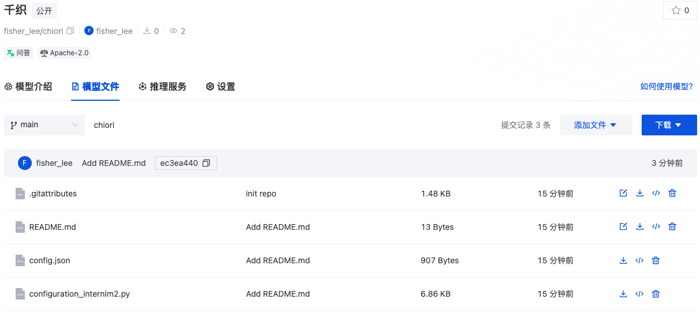

# Xtuner Homework

## 快速上手 截图

微调：


转HF：


将 HuggingFace adapter 合并到大语言模型：


TODO: 合并后的文件大小完全一样，为什么？（熟悉QLora的原理，熟悉Merge的原理）

与合并后的模型对话:


## 自定义微调 截图

转换数据格式：


**使用自定义数据微调：**


**微调后进行测试：**

转为HF格式:

```bash
xtuner convert pth_to_hf internlm_chat_7b_qlora_mqa_e3_copy.py ./work_dirs/internlm_chat_7b_qlora_mqa_e3_copy/epoch_3.pth ./hf
```

使用HF格式进行测试：

```bash
xtuner chat /root/ft-oasst1/internlm-chat-7b --adapter hf --prompt-template internlm_chat --system-template medical
```


简单测试，发现训练集可以工作，但测试集的不工作，可能是训练不充分？

## MS-Agent 截图

**训练截图：**


训练时，因modelscope的问题无法导入数据，因训练耗时，这里不进行debug。

**运行lagent**


这时，需要运行：

```bash
export MKL_SERVICE_FORCE_INTEL=1
export MKL_THREADING_LAYER=GNU
```


这时，需要修改代码，/root/xtuner019/xtuner/xtuner/tools/chat.py 中，删除任意一处 trust_remote_code

此时，继续运行，发现无法得到正确结果。


debug发现，lagent无法正确调用工具。

## 认知小助手

使用GPT整理语料，提示词如下：

```text
将这个对话整理成json数组的格式，如下```{
        "messages": [
            {
                "role": "user",
                "content": "请做一下自我介绍"
            },
            {
                "role": "assistant",
                "content": "我是「千织屋」的老板。枫丹著名服装设计师。"
            }
        ]
    }```，其中role的content是问题部分，assistant的content是千织的回答。注意，该对象中只能包含一轮对话。多轮对话需要在该对象的最外层添加数组。
```

第0轮：


第120步：


第240步：


第480步：


测试结果：


上传模型：



Github授权失败，无法继续


